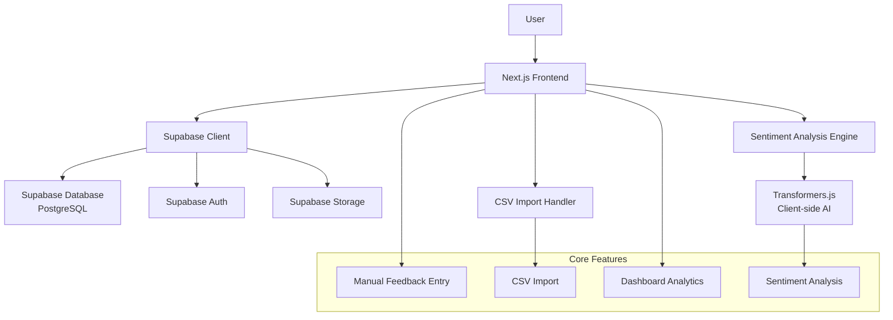
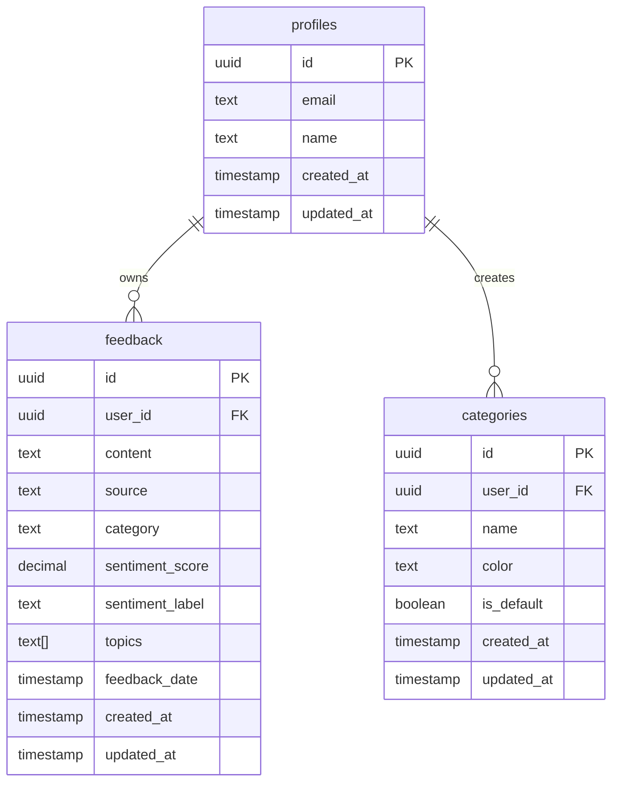
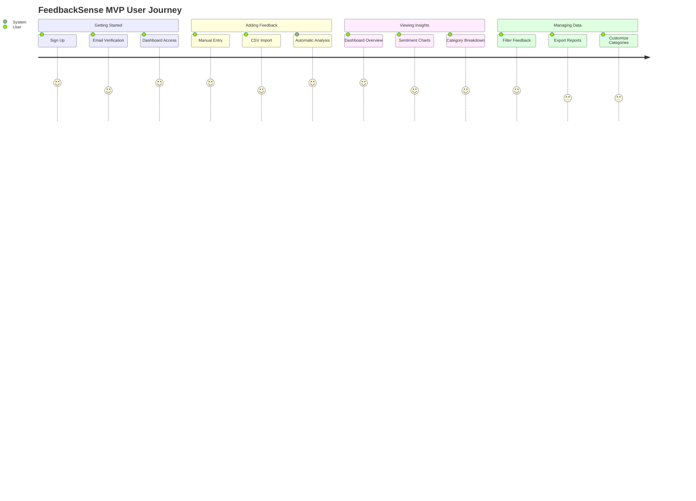

# 🏗️ FeedbackSense MVP Architecture Plan

## Project Overview

**Platform**: FeedbackSense - Customer feedback aggregation and analysis platform for small businesses
**Timeline**: 2-4 weeks MVP
**Focus**: Core feedback collection and basic sentiment analysis

## Refined Technical Stack

### Frontend & Backend (Unified)
- **Framework**: Next.js 15 (already set up) with App Router
- **Styling**: Tailwind CSS 4 (already configured)
- **Backend & Database**: Supabase (PostgreSQL + Auth + Storage + Edge Functions)
- **Authentication**: Supabase Auth (built-in social & email auth)
- **Charts**: Chart.js with react-chartjs-2
- **AI/NLP**: Sentiment analysis using Hugging Face Transformers.js (client-side)
- **File Processing**: Papa Parse for CSV handling
- **Deployment**: Vercel (seamless Next.js integration)

## MVP Architecture Overview



## Database Schema Design



## MVP Feature Breakdown

### Phase 1: Core Foundation (Week 1)

#### 1. User Authentication System
- Supabase Auth setup with email/password
- Protected routes with Row Level Security (RLS)
- Basic user profile management

#### 2. Database Setup
- Supabase project configuration
- PostgreSQL tables (profiles, feedback, categories)
- Row Level Security policies
- Database relationships and constraints

#### 3. Basic UI Framework
- Responsive layout with navigation
- Landing page with feature overview
- Dashboard structure

### Phase 2: Feedback Management (Week 2)

#### 1. Manual Feedback Entry
- [`components/FeedbackForm.jsx`](components/FeedbackForm.jsx:1) - Rich form with validation
- Category assignment (predefined + custom)
- Date selection for feedback timing
- Direct Supabase client integration

#### 2. CSV Import Functionality
- [`components/CSVImport.jsx`](components/CSVImport.jsx:1) - Drag & drop interface
- Data validation and error handling
- Batch processing with Supabase batch insert
- Column mapping interface

#### 3. Feedback List & Management
- Paginated feedback display
- Search and filter capabilities
- Edit/delete functionality

### Phase 3: Analytics & Intelligence (Week 3)

#### 1. Sentiment Analysis Integration
- [`lib/sentimentAnalysis.js`](lib/sentimentAnalysis.js:1) - Transformers.js implementation
- Real-time analysis for new feedback
- Batch analysis for imported data

#### 2. Dashboard Analytics
- Sentiment distribution charts
- Feedback volume over time
- Category breakdown
- Key metrics summary

#### 3. Basic Topic Extraction
- Simple keyword extraction
- Trending topics identification

### Phase 4: Polish & Enhancement (Week 4)

#### 1. Advanced Dashboard Features
- Interactive charts with drill-down
- Date range filtering
- Export functionality (PDF/CSV reports)

#### 2. User Experience Improvements
- Loading states and error handling
- Responsive design optimization
- Accessibility improvements

#### 3. Performance Optimization
- Client-side caching
- Database query optimization
- Image and asset optimization

## Key Technical Decisions & Rationale

### Why Next.js with Supabase
- **Faster Development**: Frontend focus with backend-as-a-service
- **Built-in Optimizations**: SSR, image optimization, automatic code splitting
- **Seamless Deployment**: Vercel integration with zero-config deployment
- **No Backend Complexity**: Supabase handles all backend infrastructure

### Why Supabase Backend
- **Complete Backend Solution**: Database, Auth, Storage, Edge Functions
- **Real-time Features**: Built-in real-time subscriptions
- **Row Level Security**: Database-level security policies
- **PostgreSQL**: Powerful relational database with JSON support
- **Free Tier**: Generous limits for MVP development
- **TypeScript Support**: Auto-generated types from database schema

### Why Client-Side Sentiment Analysis
- **Cost Effective**: No external API costs for sentiment analysis
- **Privacy**: User data stays within the application
- **Performance**: No network latency for real-time analysis
- **Scalability**: Leverages user's device computing power

## MVP User Flow



## Implementation Priority Matrix

| Feature | Impact | Effort | Priority |
|---------|---------|---------|----------|
| User Authentication | High | Medium | P0 |
| Manual Feedback Entry | High | Low | P0 |
| Basic Dashboard | High | Medium | P0 |
| CSV Import | High | Medium | P1 |
| Sentiment Analysis | High | Medium | P1 |
| Advanced Charts | Medium | High | P2 |
| Export Features | Low | Medium | P3 |

## Project Structure

```
feedbacksense/
├── app/
│   ├── (auth)/
│   │   ├── login/
│   │   └── register/
│   ├── dashboard/
│   │   ├── page.jsx
│   │   ├── analytics/
│   │   ├── feedback/
│   │   └── settings/
│   ├── globals.css
│   ├── layout.js
│   └── page.js
├── components/
│   ├── ui/
│   ├── FeedbackForm.jsx
│   ├── CSVImport.jsx
│   ├── Dashboard.jsx
│   ├── Charts/
│   ├── Navigation.jsx
│   └── AuthProvider.jsx
├── lib/
│   ├── supabase/
│   │   ├── client.js
│   │   ├── server.js
│   │   └── database.types.ts
│   ├── sentimentAnalysis.js
│   └── utils.js
├── supabase/
│   ├── migrations/
│   └── seed.sql
└── public/
    └── assets/
```

## Environment Variables Required

```env
# Supabase
NEXT_PUBLIC_SUPABASE_URL=your-supabase-url
NEXT_PUBLIC_SUPABASE_ANON_KEY=your-supabase-anon-key
SUPABASE_SERVICE_ROLE_KEY=your-service-role-key

# Optional: For advanced features
NEXT_PUBLIC_APP_URL=http://localhost:3000
```

## Deployment Strategy

### Development Environment
- Supabase local development with CLI
- Next.js development server
- Hot reloading for rapid iteration
- Local PostgreSQL via Supabase

### Production Deployment
- Vercel hosting (automatic deployments from Git)
- Supabase cloud hosting (automatic scaling)
- Environment variables for configuration
- Custom domain setup

## Success Metrics for MVP

- [x] User can register and log in
- [x] User can manually add feedback entries
- [x] User can import feedback from CSV files
- [x] System automatically analyzes sentiment
- [x] Dashboard displays meaningful insights
- [x] Application is responsive and accessible

## Dependencies to Add

```json
{
  "dependencies": {
    "@supabase/supabase-js": "^2.39.3",
    "@supabase/ssr": "^0.1.0",
    "@xenova/transformers": "^2.17.1",
    "react-chartjs-2": "^5.2.0",
    "chart.js": "^4.4.1",
    "papaparse": "^5.4.1",
    "@headlessui/react": "^1.7.17",
    "@heroicons/react": "^2.0.18",
    "date-fns": "^3.0.6",
    "zod": "^3.22.4",
    "react-hook-form": "^7.48.2",
    "react-hot-toast": "^2.4.1"
  },
  "devDependencies": {
    "@types/papaparse": "^5.3.14",
    "supabase": "^1.142.2"
  }
}
```

## Next Steps

1. **Review and approve this architecture plan**
2. **Switch to Code mode for implementation**
3. **Set up Supabase project and get API keys**
4. **Begin Phase 1 implementation with authentication system**
5. **Iterate through phases with regular testing and feedback**

## Additional Considerations

### Security
- Input validation and sanitization
- Row Level Security (RLS) policies in Supabase
- Supabase Auth with secure JWT handling
- HTTPS enforcement in production
- Database-level security constraints

### Performance
- Database indexing strategy in PostgreSQL
- Client-side caching with SWR or React Query
- Image optimization via Supabase Storage
- Bundle size optimization
- Real-time subscriptions for live updates

### Scalability
- Supabase auto-scaling infrastructure
- Edge functions for serverless computing
- CDN for static assets via Vercel
- Built-in monitoring and logging with Supabase
- PostgreSQL connection pooling

---

**Note**: This plan focuses on delivering core value quickly while maintaining code quality and scalability for future enhancements.